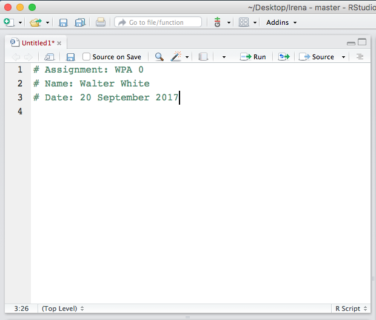
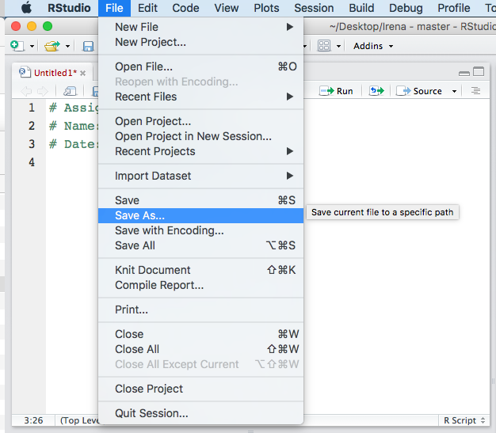
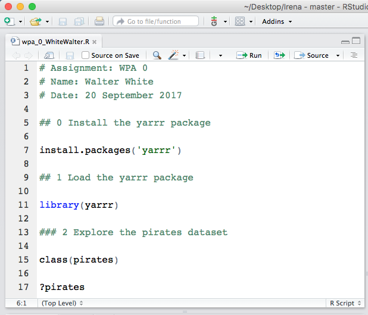

```{r global_options, include=FALSE}
knitr::opts_chunk$set(fig.width=12, fig.height=8,
                      echo=TRUE, warning=FALSE, message=FALSE, eval = FALSE, fig.align = 'center')
```

# Your first WPA!

Open the RStudio application. Then, open a new R script with File -- New File -- R Script

```{r, echo = FALSE, eval = TRUE, out.width="60%"}

```

Now you'll see a new untitled document open. At the top of the document, include the assignment, your name, and the date as follows. Be sure to include the hash tag at the beginning of each line! This tells R that you're writing a comment, not R code.

```{r, echo = FALSE, eval = TRUE, out.width="60%"}

```

Now, save the file under the name `wpa_0_LastFirst`, where `Last` is your last name, and `First` is your first name:

```{r, echo = FALSE, eval = TRUE, out.width="60%"}

```

Start working on your tasks by adding code.

```{r, echo = FALSE, eval = TRUE, out.width="60%"}

```


## 0. Install the yarrr package

First we'll install and load the `yarrr` package. The `yarrr` package contains many datasets and functions that we'll use in this course. Note that you only need to install a package once on your machine. 

```{r}
## 0: # Install and load the yarrr package
install.packages('yarrr')
```

## 1. Load the yarrr package

Now it's time to load the yarrr package. You can do this with the `library()` function.

```{r, eval = F}
## 1A: # Load the yarrr package
library(yarrr)
```

## 2. Explore the pirates dataset

The pirates dataset contains data from a survey of 1,000 pirates. The following lines of code will help you to get an idea of what's in the dataset.

```{r, eval = F}
## 2A: What class is the pirates object?
class(pirates)
```

```{r, eval = F}
## 2B: Get help for pirates data
?pirates
```

```{r}
## 2C: Print the first few rows of the dataset
head(pirates)
```

```{r}
## 2D: Show the structure of the dataset
str(pirates)
```

```{r}
## 2E: Show the entire dataset in a new window
View(pirates)
```

## 3. Basic descriptive statistics for vectors

You can access columns in a dataframe with `$`. When you do this, R will return a *vector* of values. A vector is just a combination of values of the same type.

```{r}
## 3A: Print the values of the age column
pirates$age
```

To calculate simple descriptive statistics from a vector of values, just use one of the basic descriptive statistics *functions* like `mean()`, `median()`, and `sd()`:

```{r, eval = F}
## 3B: What is the mean age?
mean(pirates$age)
```

```{r, eval = F}
## 3C: What is the median age?
median(pirates$age)
```

```{r}
## 3D: What was the maximum height?
max(pirates$height)
```

```{r}
## 3E (YOUR TURN!): What was the mean weight of the pirates?


```

If you have non-numeric data, you can calculate tables of frequencies with the `table()` function:

```{r}
## 3F: How many pirates are there of each sex?
table(pirates$sex)
```

```{r}
## 3G (YOUR TURN!): # How many pirates were there of each age?

```


## 4. Aggregated statistics by groups

To calculate descriptive statistics for different groups of data, you can use the `aggregate()` function.

```{r, eval = F}
## 4A: What was the mean age for each sex?
aggregate(formula = age ~ sex, 
          data = pirates,
          FUN = mean)
```


```{r}
## 4B: What is the median age of pirates for each combination of sex and headband?
aggregate(formula = age ~ sex + headband, 
          data = pirates,
          FUN = median)
```

```{r, eval = F}
## 4C (YOUR TURN!): What was the mean beard length for each sex?
# (Hint: The beard length column is called beard.length)


```


## 5. Histograms

```{r, eval = F}
## 5A: A default histogram of pirate ages
hist(x = pirates$age)
```


```{r}
## 5B (YOUR TURN!): A default histogram of pirate tattoos


```


```{r}
## 5C: A customized histogram of pirate ages
hist(x = pirates$age,
     main = "Distribution of pirate ages",
     col = "skyblue",
     border = "white",
     xlab = "Age",
     ylim = c(0, 400))

# Add mean label
text(x = mean(pirates$age), y = 375, 
     labels = paste("Mean = ", round(mean(pirates$age), 2)))

# Add dashed line at mean
segments(x0 = mean(pirates$age), y0 = 0, 
         x1 = mean(pirates$age), y1 = 360, 
         col = gray(.2, .2), 
         lty = 2)
```

```{r}
## 5D: Overlapping histograms of pirate ages for females and males

# Start with the female data
hist(x = pirates$age[pirates$sex == "female"],
     main = "Distribution of pirate ages by sex",
     col = transparent("red", .2),
     border = "white",
     xlab = "Age", 
     breaks = seq(0, 50, 2),
     probability = T,
     ylab = "", 
     yaxt = "n")

# Add male data
hist(x = pirates$age[pirates$sex == "male"],
     add = T, 
     probability = T, 
     border = "white",
     breaks = seq(0, 50, 2),
     col = transparent("skyblue", .5))

# Add the legend
legend(x = 40, 
       y = .05,
       col = c("red", "skyblue"),
       legend = c("Female", "Male"),
       pch = 16,
       bty = "n")
```


## 6. Scatterplots

```{r, eval = F}
## 6A: A simple scatterplot of pirate height and weight
plot(x = pirates$height,
     y = pirates$weight,
     xlab = "Height (cm)",
     ylab = "Weight (kg)")
```

```{r}
## 6B: A fancier scatterplot of the same data with some additional arguments

# Create main plot
plot(x = pirates$height, 
     y = pirates$weight,
     main = 'My first scatterplot of pirate data!',
     xlab = 'Height (in cm)',
     ylab = 'Weight (in kg)',
     pch = 16,    # Filled circles
     col = gray(0, .1)) # Transparent gray
     
# Add gridlines
grid()

# Create a linear regression model
model <- lm(formula = weight ~ height, 
            data = pirates)

# Add regression to plot
abline(model,
       col = 'blue', lty = 2)
```


## 7. Color palettes

```{r}
## 7A: Look at all the palettes from piratepal()
piratepal()
```

```{r}
## 7B: Look at the basel palette in detail
piratepal(palette = "basel", 
          plot.result = TRUE)
```

```{r}
## 7C (YOUR TURN!): Look at the "pony" palette in detail


```

```{r}
## 7D: Scatterplot of pirate height and weight using the pony palette
my.cols <- piratepal(palette = "pony", 
                     trans = .2, 
                     length.out = nrow(pirates))

# Create the plot
plot(x = pirates$height, y = pirates$weight,
     main = "Random scatterplot with My Little Pony Colors",
     xlab = "Pony height",
     ylab = "Pony weight",
     pch = 21,  # Round symbols with borders
     col = "white",  # White border
     bg = my.cols,  # Random colors
     bty = "n"  # No plot border
     )

# Add gridlines
grid()
```


### 8. Barplots

```{r, eval = F}
## 8A: Barpot of mean height by favorite.pirate

# Calculate mean height for each favorite.pirate
pirate_heights <- aggregate(height ~ favorite.pirate,
                            data = pirates,
                            FUN = mean)

barplot(pirate.heights$height, 
        main = "Barplot of mean height by favorite pirate",
        names.arg = pirate.heights$favorite.pirate)
```


```{r, eval = F}
## 8B: Same as 8A, but with customizations
barplot(pirate.heights$height, 
        ylim = c(0, 200),
        ylab = "Pirate Height (in cm)",
        main = "Barplot of mean height by favorite pirate",
        names.arg = pirate.heights$favorite.pirate, 
        col = piratepal("basel", trans = .2))

abline(h = seq(0, 200, 25), lty = 3, lwd = c(1, .5))
```


## 9. pirateplots

```{r, eval = F}
## 9A: Pirateplot of height by favorite pirate
pirateplot(formula = height ~ favorite.pirate,
           data = pirates,
           main = "Pirateplot of height by favorite pirate")
```

```{r, eval = F}
## 9B: Pirateplot of height by sex and eyepatch
pirateplot(formula = height ~ sex + eyepatch,
           data = pirates,
           main = "Pirateplot of height by favorite pirate")
```

## 10. One and two-sample sample hypothesis tests

### t-test

```{r, eval = F}
## 10A: Is the average age of pirates different from 28?
t.test(x = pirates$age, 
       mu = 28,
       alternative = 'two.sided')
```

```{r, eval = F}
## 10B: Do pirates with eyepatches have longer beards than those without eyepatches?
t.test(formula = beard.length ~ eyepatch, 
       data = pirates,
       alternative = 'two.sided')
```

### correlation test

```{r, eval = F}
## 10C: Is there a correlation between a pirate's age and the number of parrots (s)he has?
cor.test(formula = ~ age + parrots,
         data = pirates)
```

```{r}
# 10D (YOUR TURN!): Is there a correlation between weight and tattoos?
```


## 11. ANOVA

```{r, eval = F}
## 11A: ANOVA on beard.length as a function of college

# Run the ANOVA
beard_aov <- aov(formula = beard.length ~ college, 
                   data = pirates)

# Print summary results
summary(beard_aov)
```


```{r}
## 11B: Post-hoc tests on the previous ANOVA
TukeyHSD(beard_aov)
```


```{r}
## 11C: Two way ANOVA predicting tattoos as a function of sex and fav.pixar

# Run the ANOVA
tattoos_aov <- aov(formula = tattoos ~ sex + fav.pixar,  
                   data = pirates)

# Print summary results
summary(tattoos_aov)

# Results are not signifciant, so no post-hoc tests
```


```{r}
## 11D: YOUR TURN!: Conduct a two-way ANVOA see if there is an effect of favorite.pirate and sword.type on age.


```


## 12. Regression

```{r, eval = F}
## 12A: regression analysis showing if age, weight, and tattoos predict how many treasure chests a pirate has found

# Run the regression
chests_lm <- lm(formula = tchests ~ age + weight + tattoos, 
                data = pirates)

# Print summary results
summary(chests_lm)
```


```{r, eval = FALSE}
## 12B: Logistic regression analysis showing chich variables predict whether or not a pirate wears an eyepatch

# Run the regression
eyepatch_lm <- glm(formula = eyepatch ~ ., # Consider ALL variables in pirates
                  data = pirates,
                  family = "binomial")     # Logistic regression

# Print summary results
summary(eyepatch_lm)
```


## 13. Simulate random data

In the following code, we'll randomly generate three vectors of data `group_A`, `group_B`, and `group_c`. These data could reprent the result of a psychology study with three different groups. We'll make the population of group A the same as group B (mean = 10, sd = 5), but we'll make the population of group C a little larger with a mean of 12

```{r}
# group_A: 20 random samples from a normal distribution with mean = 10 and sd = 5
group_A <- rnorm(n = 20, mean = 10, sd = 5)  

# group_B: 20 random samples from the same normal distribution as group_A
group_B <- rnorm(n = 20, mean = 10, sd = 5)  

# group_C: 20 random samples from a normal distribution with mean = 12 and sd = 5
group_C <- rnorm(n = 20, mean = 12, sd = 5)

# Put into a dataframe

group_df <- data.frame(group = c(rep("A", times = 20),
                                  rep("B", times = 20),
                                  rep("C", times = 20)),
                        data = c(group_A, group_B, group_C), 
                        stringsAsFactors = FALSE)

# Print the results
group_df

# Plot the results as a pirateplot

pirateplot(formula = data ~ group,
           data = group_df,
           main = "Randomly sampled data")

# ANOVA
group_aov <- aov(formula = data ~ group, data = group_df)

# Summary table of ANOVA
summary(group_aov)

# Post hoc tests
TukeyHSD(group_aov)
```


## Submit!

- Save and email your `wpa_0_LastFirst.R` file to me at nathaniel.phillips@unibas.ch.
- Go to [https://goo.gl/forms/b9dcRH6Ud3pDagOr1](https://goo.gl/forms/b9dcRH6Ud3pDagOr1) to confirm your assignment submission.
