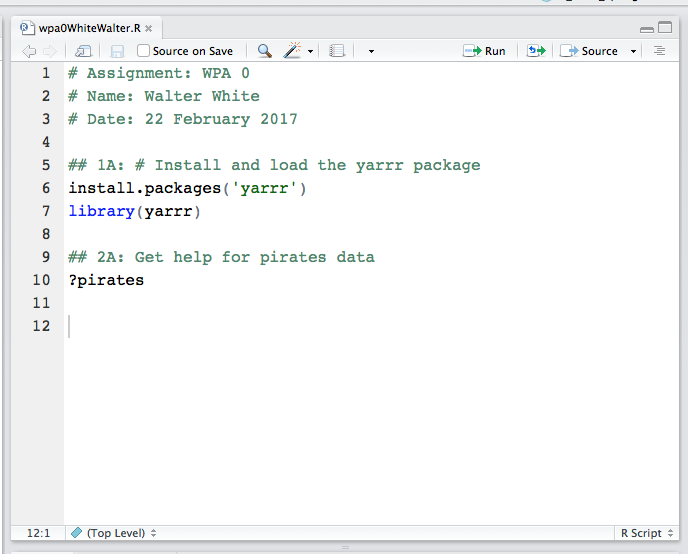

```{r global_options, include=FALSE}
knitr::opts_chunk$set(fig.width=12, fig.height=8,
                      echo=TRUE, warning=FALSE, message=FALSE, eval = FALSE)
```

# Your first WPA!

Here is your first WPA! Open a new R script in R and save it as `wpa_0_LastFirst` (where Last and First is your last and first name). At the top of your script, make sure to put the following info (make sure to put the hashtag at the beginning so R knows that it's a comment, not real R code)

```{r, eval = F}
# Assignment: WPA 0
# Name: Walter White
# Date: 28 September 2016
```





Copy and paste each of the following code chunks into your assignment

## 1. Install and load the yarrr package

First we'll install and load the `yarrr` package. The `yarrr` package contains many datasets and functions that we'll use in this course.

```{r, eval = F}
## 1A: # Install and load the yarrr package
install.packages('yarrr')
library(yarrr)
```

## 2. Explore the pirates dataset

The pirates dataset contains data from a survey of 1,000 pirates.

```{r, eval = F}
## 2A: Get help for pirates data
?pirates
```

```{r}
## 2B: Print the first few rows of the dataset
head(pirates)
```

```{r}
## 2C: Show the structure of the dataset
str(pirates)
```

```{r}
## 2D: Show the entire dataset in a new window
View(pirates)
```


## 3. Basic descriptive statistics for vectors

Descriptives for numeric data
```{r, eval = F}
## 3A: What is the mean age?
mean(pirates$age)
```

```{r}
## 3B: What was the height of the tallest pirate?
max(pirates$height)
```

```{r}
## 3C (YOUR TURN!): What was the mean weight of the pirates?


```

Descriptives for non-numeric data
```{r}
## 3D: How many pirates are there of each sex?
table(pirates$sex)
```

```{r}
## 3E (YOUR TURN!): # How many pirates were there of each age?

```


## 4. Descriptive statistics for non-numeric data

```{r, eval = F}
## 4A: What was the mean age for each sex?
aggregate(formula = age ~ sex, 
          data = pirates,
          FUN = mean)
```


```{r, eval = F}
## 4B (YOUR TURN!): What was the mean beard length for each sex?
# (Hint: The beard length column is called beard.length)


```


```{r}
## 4C: What is the median age of pirates for each combination of sex and headband?
aggregate(formula = age ~ sex + headband, 
          data = pirates,
          FUN = median)
```


## 5. Histograms

```{r, eval = F}
## 5A: A default histogram of pirate ages
hist(x = pirates$age)
```


```{r}
## 5B (YOUR TURN!): A default histogram of pirate tattoos


```


```{r}
## 5C: A customized histogram of pirate ages
hist(x = pirates$age,
     main = "Distribution of pirate ages",
     col = "skyblue",
     border = "white",
     xlab = "Age",
     ylim = c(0, 400))

# Add mean label
text(x = mean(pirates$age), y = 375, 
     labels = paste("Mean = ", round(mean(pirates$age), 2)))

# Add dashed line at mean
segments(x0 = mean(pirates$age), y0 = 0, 
         x1 = mean(pirates$age), y1 = 360, 
         col = gray(.2, .2), 
         lty = 2)
```

```{r}
## 5D: Overlapping histograms of pirate ages for females and males

# Start with the female data
hist(x = pirates$age[pirates$sex == "female"],
     main = "Distribution of pirate ages by sex",
     col = transparent("red", .2),
     border = "white",
     xlab = "Age", 
     breaks = seq(0, 50, 2),
     probability = T,
     ylab = "", 
     yaxt = "n")

# Add male data
hist(x = pirates$age[pirates$sex == "male"],
     add = T, 
     probability = T, 
     border = "white",
     breaks = seq(0, 50, 2),
     col = transparent("skyblue", .5))

# Add the legend
legend(x = 40, 
       y = .05,
       col = c("red", "skyblue"),
       legend = c("Female", "Male"),
       pch = 16,
       bty = "n")
```


## 6. Scatterplots


```{r, eval = F}
## 6A: A simple scatterplot of pirate height and weight
plot(x = pirates$height,
     y = pirates$weight,
     xlab = "Height (cm)",
     ylab = "Weight (kg)")
```

```{r}
## 6B: A fancier scatterplot of the same data with some additional arguments

# Create main plot
plot(x = pirates$height, 
     y = pirates$weight,
     main = 'My first scatterplot of pirate data!',
     xlab = 'Height (in cm)',
     ylab = 'Weight (in kg)',
     pch = 16,    # Filled circles
     col = gray(0, .1)) # Transparent gray
     
# Add gridlines
grid()

# Create a linear regression model
model <- lm(formula = weight ~ height, 
            data = pirates)

# Add regression to plot
abline(model,
       col = 'blue', lty = 2)
```


## 7. Color palettes

```{r}
## 7A: Look at all the palettes from piratepal()
piratepal()
```

```{r}
## 7B: Look at the basel palette in detail
piratepal(palette = "basel", plot.result = TRUE)
```

```{r}
## 7C (YOUR TURN!): Look at the "pony" palette in detail


```

```{r}
## 7D: Scatterplot of pirate height and weight using the pony palette
my.cols <- piratepal(palette = "pony", 
                     trans = .2, 
                     length.out = nrow(pirates))

# Create the plot
plot(x = pirates$height, y = pirates$weight,
     main = "Random scatterplot with My Little Pony Colors",
     xlab = "Pony height",
     ylab = "Pony weight",
     pch = 21,  # Round symbols with borders
     col = "white",  # White border
     bg = my.cols,  # Random colors
     bty = "n"  # No plot border
     )

# Add gridlines
grid()
```


### 8. Barplots

```{r, eval = F}
## 8A: Barpot of mean height by favorite.pirate

# Calculate mean height for each favorite.pirate
pirate.heights <- aggregate(height ~ favorite.pirate,
                     data = pirates,
                     FUN = mean)

barplot(pirate.heights$height, 
        main = "Barplot of mean height by favorite pirate",
        names.arg = pirate.heights$favorite.pirate)
```


```{r, eval = F}
## 8B: Same as 8A, but with customizations
barplot(pirate.heights$height, 
        ylim = c(0, 200),
        ylab = "Pirate Height (in cm)",
        main = "Barplot of mean height by favorite pirate",
        names.arg = pirate.heights$favorite.pirate, 
        col = piratepal("basel", trans = .2))

abline(h = seq(0, 200, 25), lty = 3, lwd = c(1, .5))
```


## 9. pirateplots

```{r, eval = F}
## 9A: Pirateplot of height by favorite pirate
pirateplot(formula = height ~ favorite.pirate,
           data = pirates,
           main = "Pirateplot of height by favorite pirate")
```

```{r, eval = F}
## 9B: Pirateplot of height by sex and eyepatch
pirateplot(formula = height ~ sex + eyepatch,
           data = pirates,
           main = "Pirateplot of height by favorite pirate")
```

## 10. Two sample hypothesis tests

### t-test

```{r, eval = F}
## 10A: Do pirates with eyepatches have longer beards than those without eyepatches?
t.test(formula = beard.length ~ eyepatch, 
       data = pirates,
       alternative = 'two.sided')
```

### correlation test

```{r, eval = F}
## 10B: Is there a correlation between a pirate's age and the number of parrots (s)he has?
cor.test(formula = ~ age + parrots,
         data = pirates)
```

```{r}
# 10C (YOUR TURN!): Is there a correlation between weight and tattoos?
```


## 11. ANOVA

```{r, eval = F}
## 11A: ANOVA on beard.length as a function of sex and college

# Run the ANOVA
beard.aov <- aov(formula = beard.length ~ sex + college, 
                   data = pirates)

# Print summary results
summary(beard.aov)
```


```{r}
## 11B: Post-hoc tests on the previous ANOVA
TukeyHSD(beard.aov)
```


## 12. Regression
```{r, eval = F}
## 12A: regression analysis showing if age, weight, and tattoos predict how many treasure chests a pirate has found

# Run the regression
chests.lm <- lm(formula = tchests ~ age + weight + tattoos, 
                data = pirates)

# Print summary results
summary(chests.lm)
```


That's it! Now it's time to submit your assignment! Save and email your `wpa0LastFirst.R` file to me at nathaniel.phillips@unibas.ch. Then, go to [http://www.rpubs.com/YaRrr/syllabus_Spring2017](http://www.rpubs.com/YaRrr/syllabus_Spring2017) to find the link for the WPA submission form.

