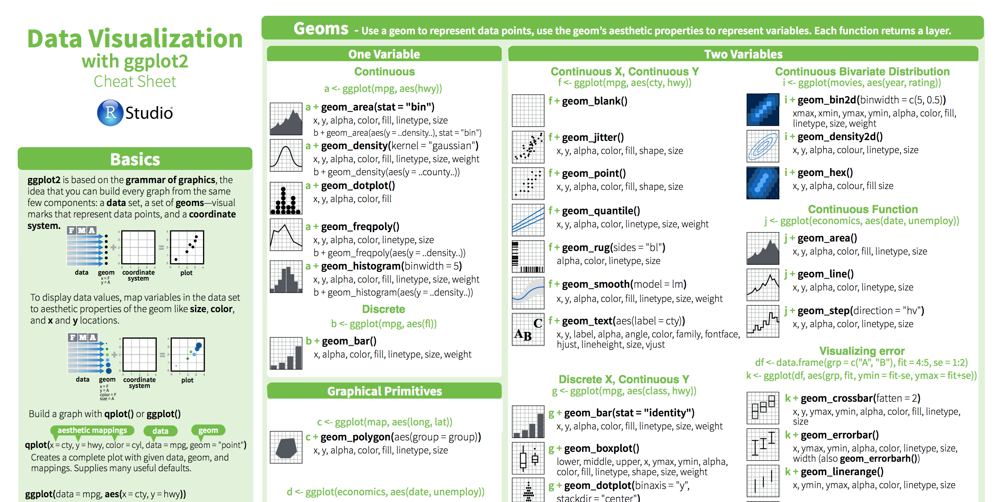
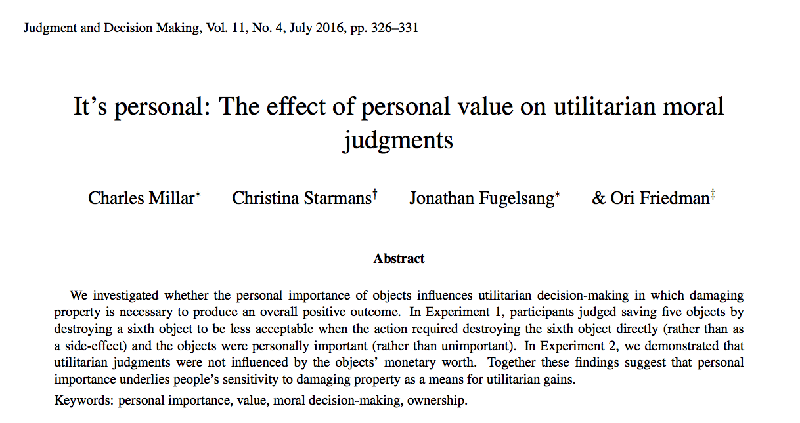

```{r global_options, include=FALSE}
knitr::opts_chunk$set(fig.width=6, fig.height=4,
                      echo=TRUE, warning=FALSE, message=FALSE, fig.align = 'center')
```


# Readings

This assignment is based on the following readings:

- R for Data Science: [Data Visualization](http://r4ds.had.co.nz/data-visualisation.html), [Exploratory Data Analysis](http://r4ds.had.co.nz/exploratory-data-analysis.html)

# Assignment Goals

- Create histograms, barplots, boxplots, and scatterplots with ggplot2

# Cheat Sheet

```{r, echo = FALSE, out.width = "80%"}

```

**Before you start anything else, open the ggplot2 cheatsheet here in a new window**: [https://www.rstudio.com/wp-content/uploads/2015/03/ggplot2-cheatsheet.pdf](https://www.rstudio.com/wp-content/uploads/2015/03/ggplot2-cheatsheet.pdf). You should keep this handy, and maybe even print one out for yourself, as it will help you to quickly find code to customise your plots.


# Inspiration and helpful links

Check out the following links for additional guides, examples, and inspiration on how to make more interesting and complex plots. All of these links contain complete replicable code. I highly recommend spending a few minutes browsing them!

- [R graph cookbook: http://www.cookbook-r.com/Graphs/](http://www.cookbook-r.com/Graphs/)
- [R Graph Catalog: http://shinyapps.stat.ubc.ca/r-graph-catalog/#fig04-16_paying-attention-data-loess-fit](http://shinyapps.stat.ubc.ca/r-graph-catalog/#fig04-16_paying-attention-data-loess-fit)
- [Top 50 ggplot2 visualizations: http://r-statistics.co/Top50-Ggplot2-Visualizations-MasterList-R-Code.html](http://r-statistics.co/Top50-Ggplot2-Visualizations-MasterList-R-Code.html)
- [ggplot2 extension gallery: http://www.ggplot2-exts.org/gallery/](http://www.ggplot2-exts.org/gallery/)
- [Color palettes](http://www.cookbook-r.com/Graphs/Colors_(ggplot2)/)


# Examples

```{r, echo = TRUE, eval = FALSE}
# Install packages 
#
# install.packages('tidyverse')
# install.packages('yarrr')
# install.packages('jtools')

library(tidyverse)   # Load tidyverse packages
library(yarrr)       # Load yarrr package (for pirates data)
library(jtools)      # Load jtools (for theme_apa())

# Set theme (try running one of these themes and see how the following plots change)

# theme_set(theme_apa())
# theme_set(theme_bw())
# theme_set(theme_minimal())

# Histogram

## Default
ggplot(data = pirates,
        aes(x = height)) + 
        geom_histogram()

## With customisations
ggplot(data = pirates,
        aes(x = height)) + 
        geom_histogram(colour = "black", 
                       fill = "white", 
                       bins = 15) + 
  labs(x = "Height (cm)",
       y = "Frequency") + 
  scale_x_continuous(breaks = seq(100, 250, 10),  # Set custom x axis
                     limits = c(120, 250)) +     
  scale_y_continuous(breaks = seq(0, 300, 50),    # Set custom 7 axis
                     limits = c(0, 300)) +
   geom_vline(xintercept = mean(pirates$height),     # Add vertical line at mean
              col = "red") + 
  geom_text(mapping = aes(x = mean(pirates$height), 
                          y = 300, 
                          label = "Mean"), 
            nudge_x = 7)  # Move text a bit to the right
  

# Continuous IV, Continuous DV
# Scatterplot

ggplot(data = pirates,
       aes(x = height, y = weight)) +
  geom_point()

# With customisations

ggplot(data = pirates,
       aes(x = height, y = weight, col = sex)) +
  geom_point(alpha = .2) + 
  geom_smooth(method = "lm", colour = "blue") +
  theme(panel.grid.major = element_line(colour = gray(.9)))

# More customizations

ggplot(data = pirates,
       aes(x = height, y = weight, col = sex)) +
  geom_point(alpha = .2) + 
  geom_smooth(method = "lm", colour = "black") +
  theme(panel.grid.major = element_line(colour = gray(.9))) +
  facet_wrap(~sex) +
  guides(col = FALSE)

# Discrete IV, Continuous DV

### Violin plot
ggplot(data = pirates,
       aes(x = factor(fav.pixar), y = tchests)) + 
         geom_violin() + 
  labs(x = "Favorite Pixar Movie",
       y = "Treasure Chests")

### Boxplot
ggplot(data = pirates,
       aes(x = sword.type, y = tchests, fill = sword.type)) + 
         geom_boxplot() + 
  labs(x = "Favorite Sword",
       y = "Treasure chests") +
  guides(fill = FALSE) # Turn off legend for filling  

### Barplot

# First, calculate aggregate data to be plotted

pirates_agg <- pirates %>% 
  group_by(headband, sex) %>%
  summarise(
    tchests_mean = mean(tchests),
    tchests_lb = t.test(tchests)$conf.int[1],
    tchests_ub = t.test(tchests)$conf.int[2]
  )

## Simple

ggplot(data = pirates_agg,
       aes(x = headband, y = tchests_mean)) + 
  geom_bar(stat = "identity") + 
  labs(y = "Mean treasure chests found")


# Grouped barplot with error bars

ggplot(data = pirates_agg,
       aes(x = headband, y = tchests_mean, fill = sex)) + 
  geom_bar(stat = "identity", position = position_dodge(0.9), col = "white") + 
  geom_errorbar(aes(ymax = tchests_lb,
                    ymin = tchests_ub), 
                position = position_dodge(0.9), 
                width = 0.25) + 
  labs(y = "Treasure chests found")

```

## It's personal: : The effect of personal value on utilitarian moral judgments

```{r, echo = FALSE, eval = TRUE}

```

In this WPA, we will analyze data from Millar et al. (2016): It's personal: : The effect of personal value on utilitarian moral judgments. 

Here is the abstract (You can find the full paper at http://journal.sjdm.org/16/16428/jdm16428.pdf):

**We investigated whether the personal importance of objects influences utilitarian decision-making in which damaging property is necessary to produce an overall positive outcome. In Experiment 1, participants judged saving five objects by destroying a sixth object to be less acceptable when the action required destroying the sixth object directly (rather than as a side-effect) and the objects were personally important (rather than unimportant). In Experiment 2, we demonstrated that utilitarian judgments were not influenced by the objects’ monetary worth. Together these findings suggest that personal importance underlies people’s sensitivity to damaging property as a means for utilitarian gains.**

# Data

The original data are stored as csv viles at sjdm.org. However, the data needed some cleaning. The cleaned versions contain the original data, but with better labels and some minor corrections.

### Study 1

- Original: [http://journal.sjdm.org/16/16428/expt1.csv](http://journal.sjdm.org/16/16428/expt1.csv)
- Cleaned [https://dl.dropboxusercontent.com/u/7618380/Millar_study1.txt](https://dl.dropboxusercontent.com/u/7618380/Millar_study1.txt)

Variable | Description 
------------  | ------------------------------------------------------- 
acceptability             | How acceptable is the action? 
important             | Were the objects important to the owner or not?
direct             | Was the destruction of an object a means of saving the others or a side-effect?
cover             | Was the object a poster or a clock?
gender             | Participant gender
age             | Participant Age
storycomp             | Comprehension question 1
itemcomp             | Comprehension question 2
ownercomp             | Comprehension question 3 
failed | Did participant fail an attention check?

### Study 2

- Original: [http://journal.sjdm.org/16/16428/expt2.csv](http://journal.sjdm.org/16/16428/expt2.csv)
- Cleaned [https://dl.dropboxusercontent.com/u/7618380/Millar_study2.txt](https://dl.dropboxusercontent.com/u/7618380/Millar_study2.txt)

Variable | Description 
------------  | ------------------------------------------------------- 
acceptability             | How acceptable is the action? 
important             | Were the objects important to the owner or not?
direct             | Was the destruction of an object a means of saving the others or a side-effect?
expensive             | Was the object expensive or not?
previoustrolley             | Did participants complete a trolley problem in the past?
gender             | Participant gender
age             | Participant Age
topiccomp             | Comprehension question 1
expensivecomp             | Comprehension question 2
importancecomp             | Comprehension question 3 
failed | Did participant fail an attention check?

0. For this assignment, you'll need both the `yarrr` package and the `tidyverse` packages. The `tidyverse` package is actually a collection of many packages, includeing `ggplot2` and `dplyr`. Install them (if you don't have them already) and then load the packages using the following code:

```{r, message = FALSE, include = FALSE}
# Load the libraries for the the assignment
library("tidyverse")  # Contains ggplot2 and dplyr
library("yarrr")
```

1. Open your R project from last week (I recommended calling it `RCourse` or something similar). There should be at least two folders in this working directory: `data` and `R`.

2. Open a new R script and save it as `wpa_5_LastFirst.R` in the `R` folder in your project directory

3. The data are stored in two separate .csv files. Study 1 is at https://raw.githubusercontent.com/ndphillips/IntroductionR_Course/master/assignments/wpa/data/Millar_study1.txt and Study 2 is at https://raw.githubusercontent.com/ndphillips/IntroductionR_Course/master/assignments/wpa/data/Millar_study2.txt. Load the data into R with the following code:

```{r, echo = TRUE, eval = TRUE}
study1 <- read.table(file = "https://raw.githubusercontent.com/ndphillips/IntroductionR_Course/master/assignments/wpa/data/Millar_study1.txt", 
                     sep = "\t",
                     header = TRUE, 
                     stringsAsFactors = FALSE)

study2 <- read.table(file = "https://raw.githubusercontent.com/ndphillips/IntroductionR_Course/master/assignments/wpa/data/Millar_study2.txt", 
                     sep = "\t",
                     header = TRUE, 
                     stringsAsFactors = FALSE)
```

4. Look at the structure of each data frame using `str()` and `head()` to make sure they were loaded correctly.

## Histograms

5. Create a histogram of the acceptability scores from study 1 using the following template. Add appropriate labels and colors as you see fit!

```{r, eval = FALSE}
ggplot(data = __,
       aes(x = __)) + 
  geom_histogram(bins = __, 
                 col = "__")) +
  scale_x_continuous(limits = c(__, __))
```

```{r, echo = FALSE}
ggplot(data = study1,
       aes(x = acceptability)) + 
  geom_histogram(bins = 10, col = "white") +
  scale_x_continuous(limits = c(0, 10))
```

6. Now do the same for study 2. And for this plot, add a vertical line at the mean of the distribution with `geom_vline` (look at http://www.sthda.com/english/wiki/ggplot2-line-types-how-to-change-line-types-of-a-graph-in-r-software for tips on creating different line types)


```{r, eval = FALSE}
ggplot(data = __,
       aes(x = __)) + 
  geom_histogram(bins = 10, col = "__", fill = "__") +
  scale_x_continuous(limits = c(__, __)) +
  geom_vline(xintercept = mean(study2$acceptability, na.rm = TRUE), 
             linetype = "dashed")
```


```{r, echo = FALSE}
ggplot(data = study2,
       aes(x = acceptability)) + 
  geom_histogram(bins = 10, col = "black", fill = "white") +
  scale_x_continuous(limits = c(0, 10)) +
  geom_vline(xintercept = mean(study2$acceptability, na.rm = TRUE), 
             linetype = "dashed")
```


## Scatterplots

7. Create a scatterplot showing the relationship between age and acceptability score in study 1. 

```{r, eval = FALSE}
ggplot(data = __,
       aes(x = __, y = __)) + 
  geom_point()
```


```{r, echo = FALSE}
ggplot(data = study1,
       aes(x = age, y = acceptability)) + 
  geom_point()
```

8. Now create the following plot using `geom_count()` instead of `geom_point()`:

```{r ,eval = FALSE}
ggplot(data = __,
       mapping = aes(x = __, y = __)) + 
  geom_count()
```

```{r, echo = FALSE}
ggplot(data = study1,
       mapping = aes(x = age, y = acceptability)) + 
  geom_count()
```

9. Now add a regression line with `geom_smooth(method = 'lm')`

```{r ,eval = FALSE}
ggplot(data = __,
       mapping = aes(x = __, y = __)) + 
  geom_count() + 
  geom_smooth(method = "__")
```

```{r, echo = FALSE}
ggplot(data = study1,
       mapping = aes(x = age, y = acceptability)) +
  geom_count() + 
  geom_smooth(method = 'lm')
```

10. Now add different colors for different genders by including `col = factor(gender)` in the aesthetic mapping:

```{r, eval = FALSE}
ggplot(data = subset(study1, gender %in% c(1, 2)),
       mapping = aes(x = __, 
                     y = __, 
                     col = factor(__))) +
  geom_count() + 
  geom_smooth(method = '__', se = FALSE) +
  scale_colour_discrete(name = "__")
```


```{r, echo = FALSE}
ggplot(data = subset(study1, gender %in% c(1, 2)),
       mapping = aes(x = age, y = acceptability, col = factor(gender))) +
  geom_count() + geom_smooth(method = 'lm', se = FALSE) +
  scale_colour_discrete(name = "Gender")
```

### Barplot

11. In this question you'll create a barplot. But first, we need to aggregate some data. Do this by running the following code:

```{r, echo = TRUE, eval = TRUE}
study1_agg_1 <- study1 %>%
  filter(complete.cases(study1)) %>%   # Only inclue rows without NAs
  group_by(important) %>%              # Group by important
  summarise(
    acceptability_mean = mean(acceptability, na.rm = TRUE),   # Mean
    acceptability_lb = t.test(acceptability)$conf.int[1],     # CI lower bound
    acceptability_ub = t.test(acceptability)$conf.int[2]      # CI upper bound
  )
```

Ok now we're ready! Create the following barplot using this template:


```{r, eval = FALSE}
ggplot(data = study1_agg_1,
       aes(x = factor(__), y = __)) + 
  geom_bar(stat = "identity", position = position_dodge(.9), col = "white") + 
  geom_errorbar(aes(ymax = __,
                    ymin = __), 
                position = position_dodge(.9), 
                width = 0.25) + 
  labs(x = "__", 
       y = "__")
```


```{r, echo = FALSE}
ggplot(data = study1_agg_1,
       aes(x = factor(important), y = acceptability_mean)) + 
  geom_bar(stat = "identity", position = position_dodge(.9), col = "white") + 
  geom_errorbar(aes(ymax = acceptability_ub,
                    ymin = acceptability_lb), 
                position = position_dodge(.9), 
                width = 0.25) + 
  labs(x = "Important", 
       y = "Acceptability")
```


12. Now we'll make a barplot with two independent variables. First, we need to aggregate the data. Do this by running the following code:

```{r, echo = TRUE, eval = TRUE}
study1_agg_2 <- study1 %>%
  filter(complete.cases(study1)) %>%   # Only inclue rows without NAs
  group_by(important, direct) %>%      # Group by important AND direct
  summarise(
    acceptability_mean = mean(acceptability, na.rm = TRUE),   # Mean
    acceptability_lb = t.test(acceptability)$conf.int[1],     # CI lower bound
    acceptability_ub = t.test(acceptability)$conf.int[2]      # CI upper bound
  )
```

Ok now we're ready! Create the following barplot using this template:

```{r, eval = FALSE}
ggplot(data = study1_agg_2,
       aes(x = factor(__), y = __, fill = factor(__))) + 
  geom_bar(stat = "identity", position = position_dodge(.9), col = "__") + 
  geom_errorbar(aes(ymax = __,
                    ymin = __), 
                position = position_dodge(.9), 
                width = 0.25) + 
  labs(x = "__", 
       y = "__") +
  scale_fill_discrete(name = "__")
```


```{r, echo = FALSE}
ggplot(data = study1_agg_2,
       aes(x = factor(important), y = acceptability_mean, fill = factor(direct))) + 
  geom_bar(stat = "identity", position = position_dodge(.9), col = "white") + 
  geom_errorbar(aes(ymax = acceptability_lb,
                    ymin = acceptability_ub), 
                position = position_dodge(.9), 
                width = 0.25) + 
  labs(x = "Important", 
       y = "Acceptability") +
  scale_fill_discrete(name = "Direct")
```


```{r, eval = TRUE, echo = FALSE}
knitr::include_graphics("https://www.mariowiki.com/images/thumb/6/65/CheckpointSM3DL.png/115px-CheckpointSM3DL.png")
```

# Checkpoint!!!

13. Create the following density plot using `geom_density()`

```{r, eval = FALSE}
ggplot(data = study2,
       aes(x = age, fill = factor(__), alpha = .2)) + 
  geom_density() +
    scale_fill_discrete(name = "__") +
  labs(y = "") +
  guides(alpha = FALSE)  
```


```{r, echo = FALSE}
ggplot(data = study2,
       aes(x = age, fill = factor(important), alpha = .2)) + 
  geom_density() +
    scale_fill_discrete(name = "Important") +
  labs(y = "") +
  guides(alpha = FALSE) # Turn off legend for filling  
```

Create the following plots from the `mpg` dataset. The `mpg` dataset is contained in the `ggplot2` package and you should have access to it once you load either the `ggplot2` package, or the `tidyverse` package (which contains `ggplot2`). You should start by looking at the `mpg` dataset to see which variables it contains.


14. Make this plot from the `mpg` dataset!

```{r, eval = FALSE}
ggplot(data = mpg,
       aes(x = __, y = __)) + 
  geom_count(alpha = .3) +
  labs(x = "__",
       y = "__")
```

```{r, echo = FALSE}
ggplot(data = mpg,
       aes(x = cty, y = hwy)) + 
  geom_count(alpha = .3) +
  labs(x = "City Miles per Gallon",
       y = "Highway Miles per Gallon")
```

15. Now this one!

```{r, eval = FALSE}
ggplot(data = __,
       aes(x = __, y = __, col = __)) + 
  geom_count(alpha = .3) +
  facet_wrap( ~ __) +
  labs(x = "__",
       y = "__") +
  guides(col = FALSE,
         size = FALSE)  
```


```{r, echo = FALSE, fig.width = 7, fig.height = 7}
ggplot(data = mpg,
       aes(x = cty, y = hwy, col = trans)) + 
  geom_count(alpha = .3) +
  facet_wrap( ~ trans) +
  labs(x = "City Miles per Gallon",
       y = "Highway Miles per Gallon") +
  guides(col = FALSE, 
         size = FALSE)
```


16. You know what to do...


```{r, echo = TRUE,  eval = FALSE}
ggplot(data = __,
       aes(x = factor(__), y = __, fill = factor(__))) + 
  geom_violin() + 
  geom_count()+
  guides(fill = FALSE, 
         size = FALSE) +
  labs(x = "__",
       y = "__")
```

```{r, echo = FALSE}
ggplot(data = mpg,
       aes(x = factor(class), y = hwy, fill = factor(class))) + 
  geom_violin() + 
  geom_count()+
  guides(fill = FALSE, 
         size = FALSE) +
  labs(x = "Class",
       y = "Highway Miles per Gallon")
```


## Submit!


- Save and email your `wpa_5_LastFirst.R` file to me at nathaniel.phillips@unibas.ch.
- Go to [https://goo.gl/forms/b9dcRH6Ud3pDagOr1](https://goo.gl/forms/b9dcRH6Ud3pDagOr1) to confirm your assignment submission.
