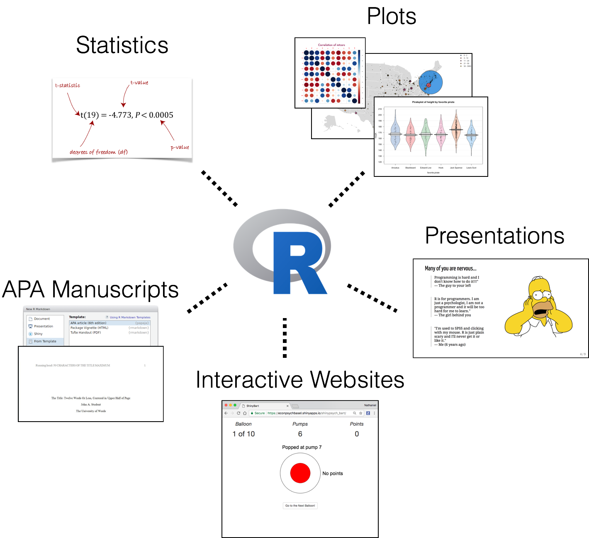

```{r, include=FALSE}
options(htmltools.dir.version = FALSE)
# see: https://github.com/yihui/xaringan
# install.packages("xaringan")
# see: 
# https://github.com/yihui/xaringan/wiki
# https://github.com/gnab/remark/wiki/Markdown
options(width=110)
options(digits = 4)

knitr::opts_chunk$set(comment=NA, fig.width=6, fig.height=6, echo = FALSE, eval = TRUE, message = FALSE, warning = FALSE, fig.align = 'center')

library(tidyverse)
library(knitr)
```


## Course Sesssions

.pull-left3[

<br>


| Session| Time| Students
|----|:-------|:----|
| 1 |     14:15 - 15:45|47
|     2| 16:15 - 17:45| 31

<br>

There is extraordinary demand for this course.

To accomodate this demand, we opened a second session.

If you would like to switch sessions, go to the Doodle Link on the right (also on the webpage) and include your contact information.

If a Session 1 and Session 2 student agree to switch, write me and I'll make the change.


]


.pull-right3[

### https://doodle.com/poll/g26anuhxqw4rr6mv

```{r, eval = TRUE, out.width = "80%"}

```


]


---

## Introduction to Statistics with R


.pull-left2[

### Course Page

https://ndphillips.github.io/IntroductionR_Course/

### Who is this guy?

Dr. Nathaniel D. Phillips, American


Post-doctoral researcher at Economic Psychology. 

Research: Judgment and decision making, risky choice, machine learning.

6 years ago I had never used R. Since then I use it almost every day. 

Sometimes all day.

...

I love it.

]

.pull-right2[
<br>
<br>

```{r, eval = TRUE, out.width = "80%"}
knitr::include_graphics("images/Rlogo.png")
```

]


---
## What can you do with R?

.pull-left3[

<br>
<br>

1. Statistics (obviously)

2. Plotting

3. Machine Learning

4. Presentations (like this one)

5. Write complete APA style manuscripts with `papaja`

6. Create interactive websites with `Shiny` (even psychology experiments!)

]


.pull-right3[

```{r}

```

]


---
## R is crazy popular


```{r, out.width = "100%"}
knitr::include_graphics("images/R_googletrends.png")
```

<font size=2>Source: Google Trends</font>


---
class: center, middle


# About this course


---
## Course topics

.pull-left3[

### Key Topics

1. Understanding the R language
2. Calculating descriptive statistics.
3. Importing, managing and accessing data.
4. Plotting
5. Simple hypothesis tests
6. ANOVAs
7. Regression
8. Programming with functions and loops.
9. Writing APA style documents with `papaja`

### Bonus Topics (if time allows)

B1. Bayesian statistics

B2. Mixed-Effects regression

B3. Code management with GitHub

B4. Writing presentations (like this one)

]


.pull-right3[

### Course Schedule

On the course website

```{r, out.width = "80%"}

```
]

---
## Many of you are nervous...

.pull-left3[


><font size = 5>Programming is hard and I don't know how to do it!!!"<br>
>--- The guy to your left </font>

<br>

><font size = 5>R is for programmers. I am just a psychologist, I am not a programmer and it will be too hard for me to learn."<br>
>--- The girl behind you </font>

<br>

><font size = 5>"I'm used to SPSS and clicking with my mouse. R is just plain scary and I'll never get it or like it."<br>
>--- Me (6 years ago) </font>

]


.pull-right3[
```{r}

```


]


---
class: center, middle

#Bullshit!


---
## Programming is awesome

.pull-left3[
<br>

<font size = 1>Anyone can learn to program.</font>

<br>

<font size = 3>Anyone can learn to program!</font>

<br>

<font size = 5, col = "red">Anyone can learn to program!</font>

<br>

<font size = 8>Anyone can learn to program!</font>


]

.pull-right3[
```{r}

```


]


---
## Two Mindsets

.pull-left3[

<br>
<br>

```{r, out.width = "100%", fig.cap = "<a href='https://goo.gl/DTdfh2'>Source: Mindset (Carol Dweck)</a>"}

```


]

.pull-right3[


<br>
<br>

<font size = 5>Adopt the Growth mindset!</font>
<br>

| | **Fixed**|*Growth*|
|:------|:----|:-----|
|     Challenges|    Avoid|Embrace!     |
|     Obstacles|    Give up early|Persist!     |
|     Effort|    Worthless|Path to mastery     |
|     Criticism|    Ignore|Learn     |
|     Success of Others|    Feel threatened|Feel inspired     |

]


---
## Flipped Classroom

.pull-left3[
<br>
<font size=5>This is a "Flipped Classroom"</font>

At home: Read book chapters, watch YouTube videos, and do practice problems.

In class: Work *together* on Weekly Programming Assignments (WPAs)

]


.pull-right3[

<br>
<br>
```{r, fig.cap = "<a href='https://ctl.boisestate.edu/flipping/files/2015/05/flippedflowmodel.png'>Source: https://ctl.boisestate.edu</a>"}

```


]


---
## Learn at home

```{r, out.width = "100%"}

```


---

## In-class WPAs

.pull-left4[

Several programming tasks. Both simple and challenging.

Work together. Ask for help. Do as much as you can.

Try to reach the **Checkpoint** to make sure you aren't falling behind.

After 1.5 hours, submit *whatever* you have completed. You'll get 100% credit. Every time. No questions asked.

]

.pull-right4[

```{r, out.width = "100%"}

```

]


---
## Work together!

.pull-left3[

The best way to learn programming is to work together!

Ask for help, teach each other.

Write your own code, submit your own assignment.

```{r, out.width = "100%"}

```


]

.pull-right3[

### 5 Great question to ask when you get stuck


| Level| Question|
|----|:---------------------------------|
| 1 |      I have **absolutely no** idea what I'm supposed to do! Help!   |
|     2| I know what I'm supposed to do but I don't know how to get started. Help!     |
|     3|    My code should be working but it's not! R must be broken! Help!     |
|     4|    My code works but I don't know why...Help!     |
|     5|    I think I got it, but is there a better way to solve this task? Help!    |

]


---
## There is a rumor...


```{r, out.width = "80%"}

```


---
## There is a rumor...


```{r, out.width = "80%"}

```


---
## That's not true

---
## This is true

```{r, out.width = "80%"}

```


---
## Final Project

<br>
<br>

At the end of the course, you'll complete a final analysis project.

Use **any** dataset you want (or I'll give you one).

Show off your R skills, discover new techniques for your data.

Last 2 / 3 weeks of class are for in-class project work. Get help!

...More details later in the semester


---
## Grading

.pull-left3[

Pass / Fail course

If you miss a class, email me, do the WPA at home and submit as soon as you can.

If you adopt a growth mindset, ask questions, challenge yourself, do your WPAs, and submit a final project, you'll pass.

This will be a fun class. Don't worry about your grade, focus on learning R!

]


.pull-right3[

```{r, out.width = "100%"}

```

]


---
## Questions?

### Course Webpage

### https://ndphillips.github.io/IntroductionR_Course/


```{r, out.width = "60%"}

```


---
## Let's get started


# Open the course webpage in a web browser

- ### https://ndphillips.github.io/IntroductionR_Course/

# Open RStudio

# We'll play around a bit together then work on WPA 0

# Stop 10 minutes before class ends and submit your assignment

---
# Extra slides

---
## Top 10 reasons that people take this course:

--

1. To analyse thesis data.

--

2. To analyse thesis data.

--

3. To analyse thesis data.

--

4. To analyse thesis data.

5. To analyse thesis data.

6. To analyse thesis data.

7. To analyse thesis data.

8. To analyse thesis data.

9. To analyse thesis data.

--

<font color="red">10. I think R could be a great skill to develop for my long-term career </font> <font color="gray">(and to analyse my thesis data)</font>


---
class: center, middle


# Shiny

Interactive websites. Programmed in R!


---
## TweetAnalyzer

<iframe src="https://longhowlam.shinyapps.io/TweetAnalyzer/", width=1000, height=600></iframe>

---
## BART -- Balloon Analogue Risk Task

<iframe src="https://econpsychbasel.shinyapps.io/shinypsych_bart/", width=1000, height=600></iframe>


